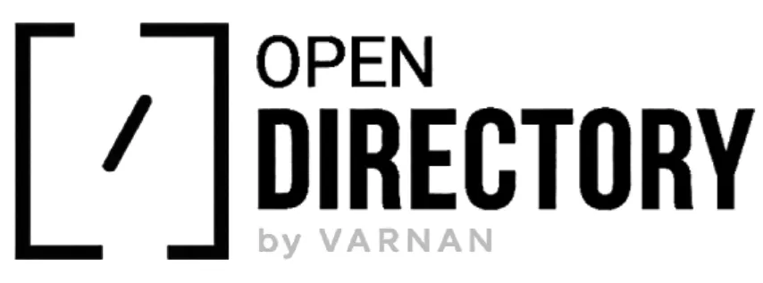

<div align="center">
  
</div>

# OpenDirectory

OpenDirectory is a production grade, open source registry and command line interface for AI Agent Skills. It provides a centralized repository of specialized instructions and capabilities that can be injected into various AI assistants and development agents.

By using OpenDirectory, developers can extend the functionality of their AI tools with pre-configured skills for tasks such as documentation generation, codebase analysis, web scraping, and automated project management.

## What is OpenDirectory?

OpenDirectory acts as a bridge between specialized AI instructions and the agents that execute them. It solves the problem of fragmented agent configurations by providing a standardized format for skills and a unified CLI to manage their installation across different platforms.

Each skill in the directory is a self contained package consisting of a SKILL.md file that defines the agent's behavior, along with any necessary supporting assets. The CLI handles the complexity of placing these files in the correct locations for each supported agent, whether you are working in a local project or want the skill available globally.

## Getting Started

The easiest way to use OpenDirectory is via npx, which allows you to run the CLI without a permanent installation.

### List Available Skills

To browse the registry and see all available skills:

```bash
npx @opendirectory.dev/skills list
```

This command displays a table of all skills currently available in the registry, including their names and brief descriptions.

### Install a Skill

To install a specific skill, use the install command with a target agent.

#### Local Installation

By default, skills are installed into the current working directory. This is ideal for project specific configurations.

```bash
npx @opendirectory.dev/skills install claude-md-generator --target claude
```

#### Global Installation

If you want a skill to be available across all your projects, use the --global flag.

```bash
npx @opendirectory.dev/skills install claude-md-generator --target claude --global
```

## Supported Agents and File Structures

OpenDirectory supports a wide range of AI agents. The CLI automatically manages the directory structure for each target.

### OpenCode
OpenCode is a specialized agent for development tasks.
- Local: ./.opencode/skills/[skill-name]/
- Global: ~/.config/opencode/skills/[skill-name]/

### Claude Code (claude)
The official CLI agent from Anthropic.
- Local: ./.claude/skills/[skill-name]/
- Global: ~/.claude/skills/[skill-name]/

### Codex
A versatile agent for code generation and analysis.
- Local: ./.codex/skills/[skill-name]/
- Global: ~/.codex/skills/[skill-name]/

### Gemini CLI (gemini)
Google's command line interface for Gemini models.
- Local: ./.gemini/skills/[skill-name]/
- Global: ~/.gemini/skills/[skill-name]/

### Anti-Gravity
A high performance agent framework.
- Local: ./.agent/skills/[skill-name]/
- Global: ~/.gemini/antigravity/skills/[skill-name]/

### OpenClaw
An open source alternative for agentic workflows.
- Local: ./.openclaw/skills/[skill-name]/
- Global: ~/.openclaw/skills/[skill-name]/

### Hermes
A lightweight agent focused on speed and efficiency.
- Local: ./.hermes/skills/[skill-name]/
- Global: ~/.hermes/skills/[skill-name]/
- Note: For local installations, the CLI also updates ~/.hermes/config.yaml to include the local skills directory.

## How to Contribute

We welcome contributions from the community. Whether you want to add a new skill, improve the CLI, or update documentation, please refer to our [CONTRIBUTING.md](CONTRIBUTING.md) for detailed guidelines.

**Contributor Rewards:** Top contributors to the OpenDirectory project will receive free exclusive merchandis from our team as a thank you!

All new skills must follow a strict format and undergo a security review before being merged into the main registry.

## License

This project is licensed under the MIT License. See the LICENSE file for details.
