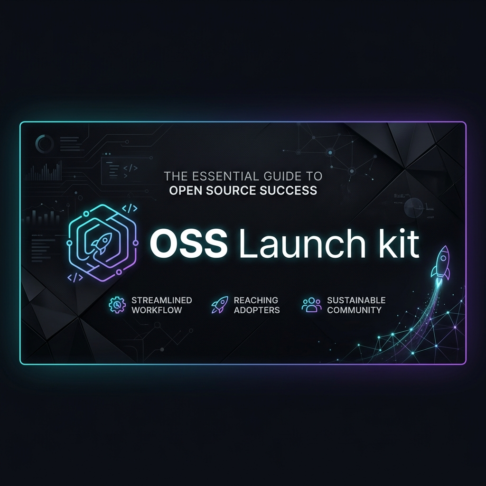

# oss-launch-kit (Orchestrator)

The high-level **OSS Launch Orchestrator** for GitHub repositories. It serves as the strategic entry point that analyzes your repo and coordinates a multi-channel launch plan.

## Features

- **Project Analysis**: Differentiates between CLI tools, libraries, apps, and templates.
- **Enhanced Readiness**: Checks for installation guides, usage examples, license, and metadata.
- **Channel Orchestration**: Recommends the best channels (PH, HN, Reddit, X) based on fitness.
- **Skill Hand-offs**: Provides hooks and pointers to `show-hn-writer`, `producthunt-launch-kit`, and `reddit-post-engine`.
- **Honest Feedback**: Explicitly flags low-readiness repos and recommends documentation sprints.

## Usage

```bash
# Generate a launch strategy and checklist for a repo
python scripts/run.py --repo-url https://github.com/owner/repo
```

## Differentiation

Unlike single-channel generators, `oss-launch-kit` acts as the **Root Strategy Layer**:
1. It tells you **if and where** you should launch.
2. It provides a **timed checklist** for coordination.
3. It hands off to **specialized skills** for channel-specific drafting.
